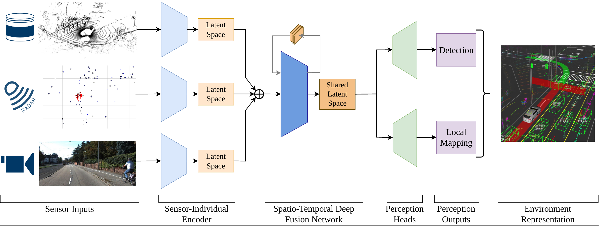

# DeepSTEP - Deep-Learning Based Spatio-Temporal End-to-End Perception for Autonomous Vehicles

This repository provides a neural network for object detection and local mapping using multi-modal sensor data from camera, LiDAR, and RaDAR.
This is the official repository to our [paper](https://arxiv.org/abs/2305.06820) presented at the IEEE IV 2023.

## Citation
If you find our work useful in your research, please consider citing:

    @INPROCEEDINGS{DeepSTEP2023,
      author={Huch, Sebastian and Sauerbeck, Florian and Betz, Johannes},
      booktitle={2023 IEEE Intelligent Vehicles Symposium (IV)}, 
      title={DeepSTEP - Deep Learning-Based Spatio-Temporal End-To-End Perception for Autonomous Vehicles}, 
      year={2023},
      volume={},
      number={},
      pages={1-8},
      doi={10.1109/IV55152.2023.10186768}}